# Adventures with Edison — Native Reimplementation

A clean-room, native reimplementation of the engine behind *Corel's Adventures with Edison* (1995, developed by Artech Studios), so the original games can run on modern systems without Windows 3.1 emulation.

**This repository contains no original game data.** You need your own copy of the CD: put the ISO in `original/` and its files in `original/cd/` (both ignored by git; see [Getting the game's files](#getting-the-games-files)).

## Screenshots

Captured from the port (`edison --capture`); the artwork is the original games'.

| | | |
|---|---|---|
| 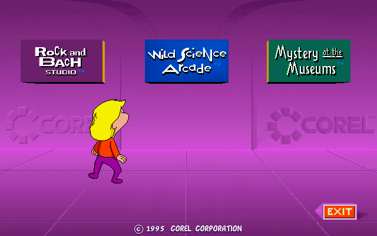 | 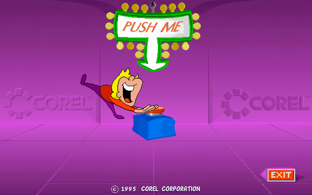 | 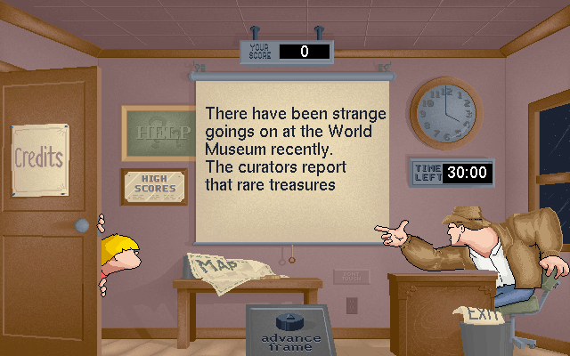 |
| The main menu | The opening | Mystery at the Museums: the office |
| 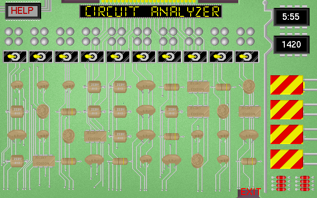 | 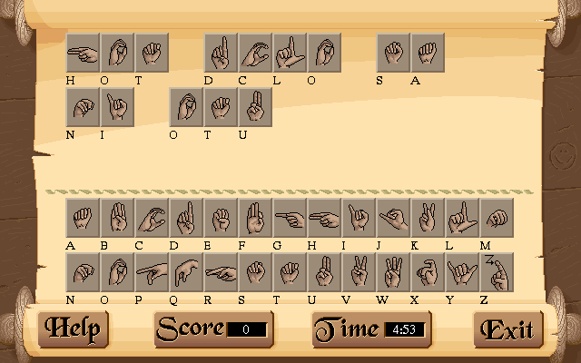 | 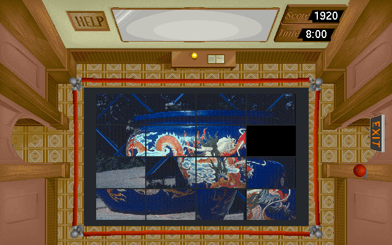 |
| Mystery: the circuit analyzer | Mystery: sign language | Mystery: a picture puzzle |
| 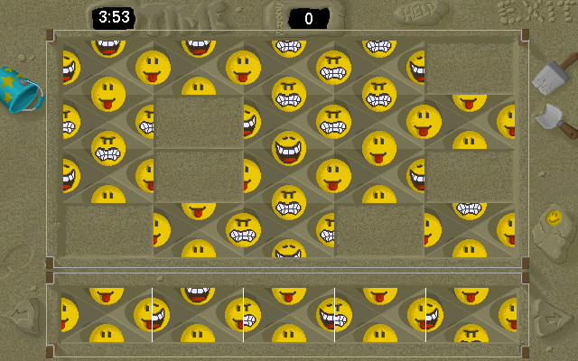 | 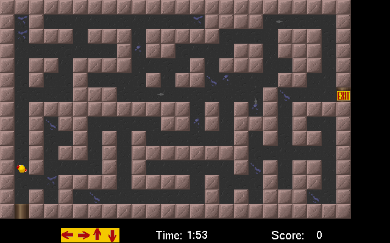 | 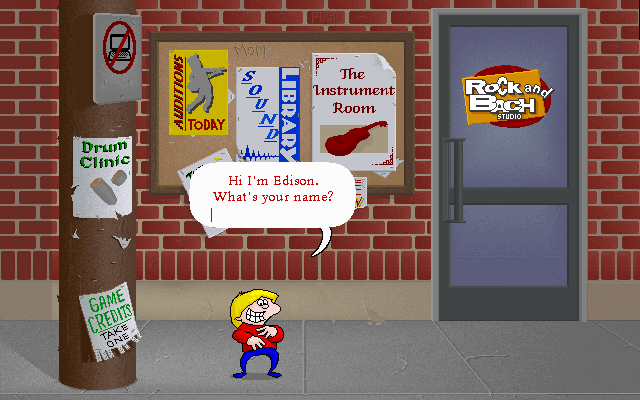 |
| Mystery: the smileys | Mystery: the bonus maze | Rock and Bach: the hallway |
| 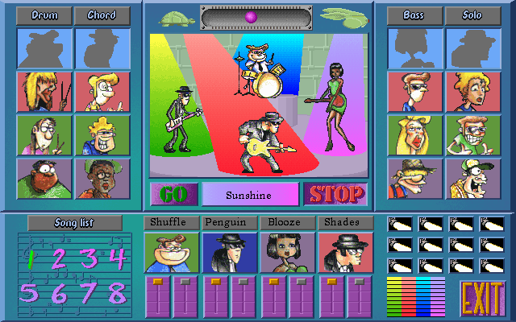 | 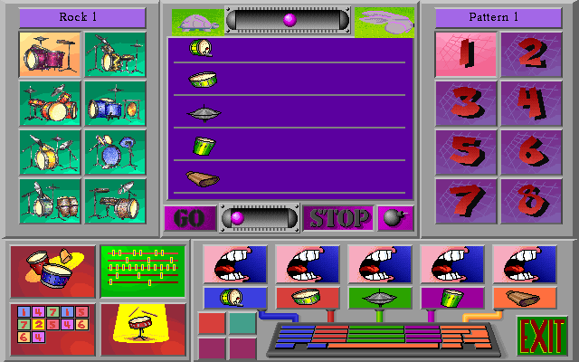 | 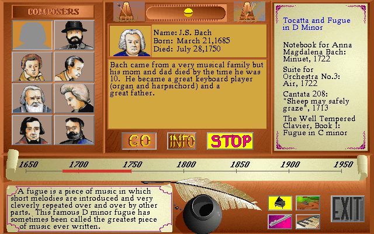 |
| Rock and Bach: the jukebox | Rock and Bach: the Drum Clinic | Rock and Bach: the Music Library |
| 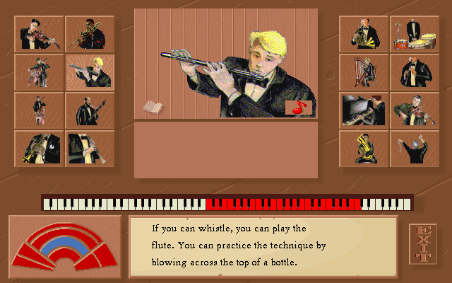 | 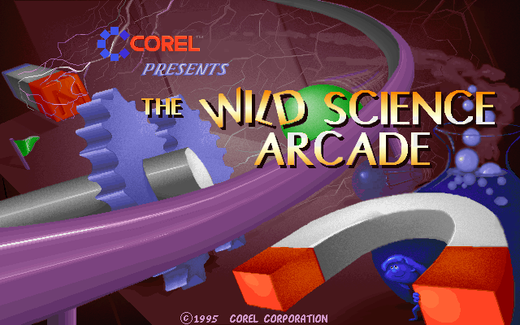 | 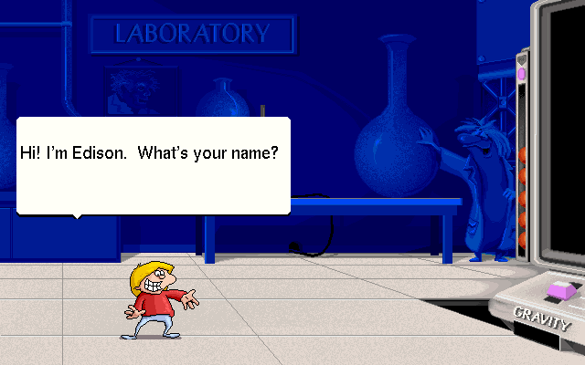 |
| Rock and Bach: the Instrument Room | Wild Science Arcade: the title | Wild Science Arcade: the laboratory |
| 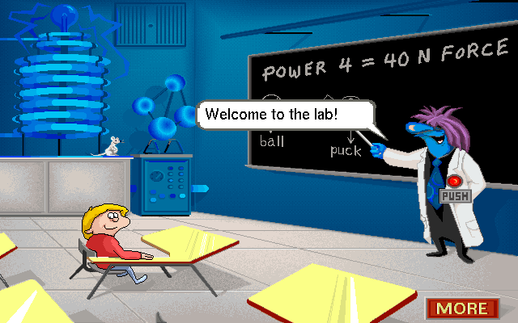 | 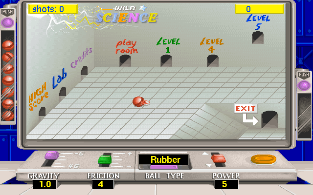 | 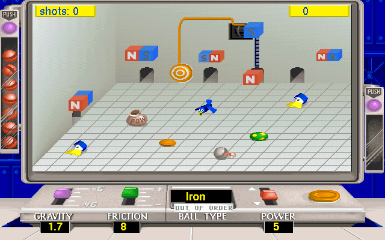 |
| Wild Science Arcade: a lesson | Wild Science Arcade: the menu table | Wild Science Arcade: magnets |
| 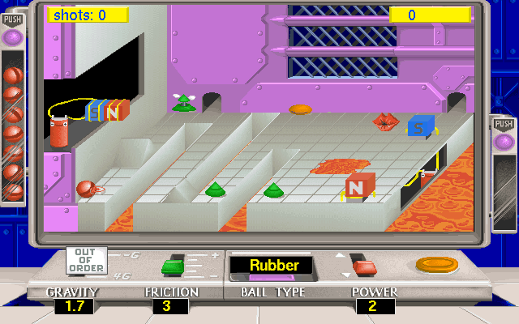 | 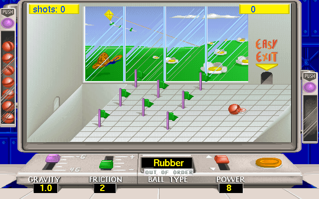 | |
| Wild Science Arcade: lava | Wild Science Arcade: the garden | |

## Games on the disc

| Executable | Game |
|---|---|
| `EDISON.EXE` | Main menu shell |
| `WINMAIN.EXE` | Rock and Bach (music maker) |
| `WMAIN.EXE` | Wild Science Arcade |
| `MALL.EXE` | Mystery Mall |

## Layout

- `original/`: your ISO and extracted CD contents (git-ignored)
- `extracted/`: assets unpacked by our tools (git-ignored)
- `tools/`: asset extraction and format-analysis scripts (`pip install -r requirements.txt`)
- `engine/`: the native reimplementation
- `docs/`: file-format and engine notes

## Getting the game's files

Copy the whole CD into `original/cd/`, so that `original/cd/DSK3/EDISON.EXE`
exists next to `original/cd/MYSTERY/`, `original/cd/RB/` and
`original/cd/SCIENCE/` (the speech and sounds). From an ISO:

- **Windows:** double-click the ISO to mount it, then copy the drive's contents into `original\cd\`; or `7z x your.iso -ooriginal/cd` with [7-Zip](https://www.7-zip.org/).
- **macOS:** `hdiutil attach your.iso`, then `cp -R /Volumes/<name>/ original/cd/` and `hdiutil detach /Volumes/<name>`.
- **Linux:** `7z x your.iso -ooriginal/cd` (package `p7zip-full` or `7zip`), or `sudo mount -o loop,ro your.iso /mnt` and `cp -r /mnt/. original/cd/`.

The port matches file names without regard to case, so lower-case copies of the files work too.

## Building the port

Requires CMake 3.20+, a C++17 compiler (GCC, Clang or MSVC), Ninja and git;
SDL3 and Nuked-OPL3 are downloaded and built automatically at configure time.

```sh
cmake -S . -B build -G Ninja -DCMAKE_BUILD_TYPE=Release
cmake --build build
```

- **Windows:** either Visual Studio 2022 (or its Build Tools) with the "Desktop development with C++" workload, run from a *Developer PowerShell*; or [MinGW-w64](https://winlibs.com/) GCC with Ninja on the PATH. The executables are `build\engine\*.exe`. This is the platform the port is developed and tested on.
- **Linux** (untested so far): install a compiler and the headers SDL3 builds against, e.g. on Debian or Ubuntu:
  ```sh
  sudo apt install build-essential cmake ninja-build git pkg-config \
      libasound2-dev libpulse-dev libx11-dev libxext-dev libxrandr-dev libxcursor-dev \
      libxi-dev libxss-dev libxkbcommon-dev libwayland-dev libegl1-mesa-dev libgl1-mesa-dev
  ```
- **macOS** (untested so far): `xcode-select --install` for the compiler, then `brew install cmake ninja` with [Homebrew](https://brew.sh/).

## Running the port

`edison` is the native version of EDISON.EXE: the opening, the main menu and Mystery at the Museums (the whole game), with FM music and sound effects. Rock and Bach is ported; Wild Science Arcade is well along (its title, story, laboratory, lessons and the arcade's tables and rooms, checked against the original, with its FM music). Open items are tracked in [TODO.md](TODO.md).

Run it from the repository's folder (the CD folder defaults to `original/cd/DSK3`, and saved games and high scores go to `save/`), or pass the CD's `DSK3` folder:

```sh
build/engine/edison                        # Windows: build\engine\edison.exe
build/engine/edison /path/to/cd/DSK3       # the CD's files somewhere else
build/engine/edison -O                     # skip the opening (-A: no FM music)
build/engine/edison --game mystery         # straight into a game: mystery, rockbach, science
build/engine/edison --game science --room 1    # the Wild Science Arcade's menu table
```

`edison --help` isn't there yet: the options are listed at the top of [engine/apps/edison.cpp](engine/apps/edison.cpp) (testing ones too: `--capture`, `--click`, `--type`, `--virtual-clock`, `--hidden`).

## Running the original

The original is a 16-bit Windows 3.1 program, which 64-bit Windows can't run by itself. Make a run folder:

1. Copy everything in the CD's `DSK3` into it, and the WinG files (`WING.DLL`, `WING32.DLL`, `WINGDE.DLL`) from `DSK2`.
2. For Wild Science, copy the CD's `SCIENCE\*.WAV` into a `data\` folder in it (winevdm has no CD drive for it to read them from).
3. Start `EDISON.EXE` (the menu), or a game directly: `MALL.EXE` (Mystery), `WINMAIN.EXE` (Rock and Bach), `WMAIN.EXE` (Wild Science; `-A` turns the FM music off).

- **Windows:** with [winevdm](https://github.com/otya128/winevdm) (otvdm): `otvdmw.exe EDISON.EXE` from the run folder. This is how the port is compared with the original; `tools/reference/otvdm.ps1` (below) wraps it.
- **Linux** (untested): [Wine](https://www.winehq.org/) runs 16-bit Windows programs: `wine EDISON.EXE` from the run folder.
- **macOS** (untested): Wine on macOS can't run 16-bit code; use [DOSBox-X](https://dosbox-x.com/) with your own copy of Windows 3.1 installed in it, and the run folder on its C: drive.

## Other tools

### Music player

`fmplay` plays the game's FM music and sound effects straight from its DLLs,
at the game's music rate (72 updates per 76 ticks of a 13 ms timer, about 72.9 Hz):

```sh
build/engine/fmplay original/cd/DSK3/ADLIB.DLL                  # list sounds by name
build/engine/fmplay original/cd/DSK3/ADLIB.DLL SUNROCK1 SUNROCK2 SUNROCK3 SUNROCK4                     SUNROCK5 SUNROCK6 SUNROCK7 SUNROCK8          # a Rock and Bach band
build/engine/fmplay original/cd/DSK3/MADLIB.DLL DROPTILE --wav droptile.wav
build/engine/fmplay original/cd/DSK3/SADLIB.DLL 13             # Wild Science's title song (by id: its debug info has no names)
```

### Sequencer test

`seqtest` replays every sound through the native FM driver and compares the
OPL register stream with reference logs recorded from the original driver:

```sh
python -m venv .venv && .venv/Scripts/pip install -r requirements.txt
.venv/Scripts/python tools/oplref.py ADLIB.DLL ADLIB1.DLL ADLIB2.DLL ADLIB3.DLL ADLIB4.DLL CADLIB.DLL MADLIB.DLL SADLIB.DLL
.venv/Scripts/python tools/oplfuzz.py            # synthetic songs covering every opcode
ctest --test-dir build --output-on-failure
```

## Reverse-engineering tools

- `tools/nedis.py FILE.EXE`: whole-program disassembly with Windows imports named, cross-segment calls resolved and string references shown. It writes `extracted/disasm/<exe>.asm`, plus `<exe>.funcs.txt`, a one-line-per-function summary to grep.
- `tools/wmclasses.py [--rooms]`: Wild Science's C++ classes (after `nedis.py` on `WMAIN.EXE`): their names from Borland's RTTI, bases (virtual ones too), vtables and slots, to `extracted/disasm/wmain.classes.txt` (see `docs/SCIENCE.md`).
- `tools/ghidra/decompile.sh FILE.EXE ...`: headless Ghidra decompilation to `extracted/ghidra/<exe>.c`.
  - Imports from the CD's DLLs are named, and functions found by `nedis.py` are added.
  - Needs [Ghidra](https://github.com/NationalSecurityAgency/ghidra) 12 and a JDK 21. Set `GHIDRA` to its folder, and `JAVA_HOME` unless `java` is on the PATH.
- `tools/scripts.py`: decompiles the menu scripts (see `docs/GAME.md`).
- `tools/reference/otvdm.ps1 start|play|shot|dialogs|stop|unlock|click|rclick|down|up|move|type|run`: runs the original game under [winevdm](https://github.com/otya128/winevdm) as a visual reference.
  - `click`, `rclick`, `down`/`up` (hold the button), `move` and `type` post input to the game's window (the real cursor isn't moved); `run SCRIPT DIR` plays a script of those, `wait` and `shot` steps (see `tools/reference/*.txt`); `play EXE SCRIPT DIR` starts the game, runs the script and stops the game whatever happens, so the next start is clean (use it in test scripts).
  - `tools/reference/screendiff.py PORT.bmp ORIGINAL.png OUT.png` compares a port capture (`--capture`) with a screenshot of the original.
  - `tools/reference/memwatch.py find|peek|watch|dump EXE ...` reads the running original's memory: it finds the program's live data segment (DGROUP) in the otvdmw process by the executable's own static data, then evaluates expressions that follow near pointers, e.g. `vx=[[[5ffc+ae]+f77]+2]+62` (the Wild Science ball's x velocity). `watch` prints a line whenever the values change. Read-only. It works for EDISON, MALL and WINMAIN too (each one's automatic data segment).
  - `tools/reference/tracecmp.py ORIGINAL.txt PORT.log` compares a `memwatch.py watch` trace with the port's log, state by state, ignoring timing. A read caught mid-update, or a state the port only passed through within a tick (it says how many), counts as matching. Start `watch` once the game is up (and no other winevdm is running), or it can pick the wrong copy of the data.
  - `edison --hidden` runs with no window shown and the sound muted, for test runs in the background.

#### Booting and cleaning up the original

The original's error boxes often have no owner, so winevdm attaches them to whatever window is in front, usually your terminal, and Windows disables that window until the box closes. If the game is killed or crashes while a box is open, the window (often every Windows Terminal window, since they share a process) stays disabled.

```powershell
pwsh tools/reference/otvdm.ps1 start                # boot EDISON.EXE (or: start WMAIN.EXE); stops a leftover run first
pwsh tools/reference/otvdm.ps1 dialogs              # check for open error boxes
pwsh tools/reference/otvdm.ps1 stop                 # always end a session with this
pwsh tools/reference/otvdm.ps1 unlock               # if the game already died
```

- `start` runs the game in a window: it hides the black, screen-sized backdrop that the game's library opens behind its 640x400 window, and keeps the game window on top so other windows can't cover it in shots. Set `OTVDM_FULLSCREEN=1` to keep the backdrop.
- To get to the Wild Science Arcade's menu table quickly, `python tools/reference/wmain_skip.py` writes `WMAINSKP.EXE` into the run folder. It's a copy with the intro flag cleared, so `start "WMAINSKP.EXE -A"` skips the title, the story, the lab and the professor and is at room 1 in about 8 seconds. In the port, `edison --game science --room 1` does the same.
- `start` stops any run left over from before (an interrupted test, a crash) first, and `play` always ends with `stop`, even when a step fails; `tools/testing/trace.sh` does the same.
- If `WMAIN.EXE` or `WMAINSKP.EXE` shows only a black window or nothing at all (seen after a reboot, and once mid-session), `stop` it, run the full `WMAIN.EXE -A` until its story starts, stop it, and try again (running `EDISON.EXE` once helped the first time). `WMAINSKP.EXE` at room 1 has only 3 threads until a sound plays, so check it with a shot.
- Always end with `stop`, never by killing `otvdmw` or closing its window. `stop` closes dialogs, asks the game to quit, kills it only as a last resort, and then re-enables disabled windows.
- **Symptom:** a window that chimes when clicked and ignores all input is disabled, not frozen. Run `unlock` from any working shell (such as a new terminal window from the Start menu, or Claude Code's shell). It re-enables those windows; it skips conpty's `PseudoConsoleWindow`, UWP frames and DWM's listener window, which are disabled by design.

## Status

- [x] Unpack PKWARE DCL archives (`*.D01`, `GRAFX.DAT`)
- [x] Identify fonts, palettes, text resources
- [x] Document animation / layout formats (groups 03, 50, 60, .VID, .SRF; docs/FORMATS.md)
- [x] Decode FM music sequencer command set (docs/SEQUENCER.md)
- [x] Reference OPL log harness (run original driver under emulation)
- [x] Native C++ sequencer: all 898 sounds match the original driver write-for-write
- [x] Software OPL + audio output: `fmplay` (Nuked-OPL3, SDL3)
- [x] Readable refactor of the sequencer; differential tests cover all 57 opcodes (1,685 cases match)
- [ ] Decode the game's real Rock and Bach tempo (fmplay uses 128 for now)
- [x] Document `.SRF` / `.HS` formats
- [ ] Decompile game logic (Ghidra, 16-bit NE)
- [x] Engine skeleton (SDL) + software OPL for FM music

## Licences

Third-party code fetched at build time: SDL3 (zlib licence) and Nuked-OPL3
(LGPL-2.1; distributing binaries requires allowing users to relink against a
modified Nuked-OPL3).
